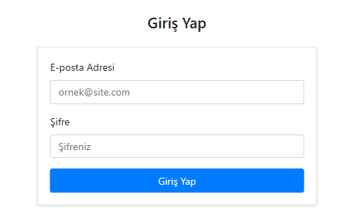
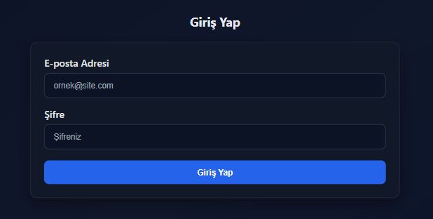
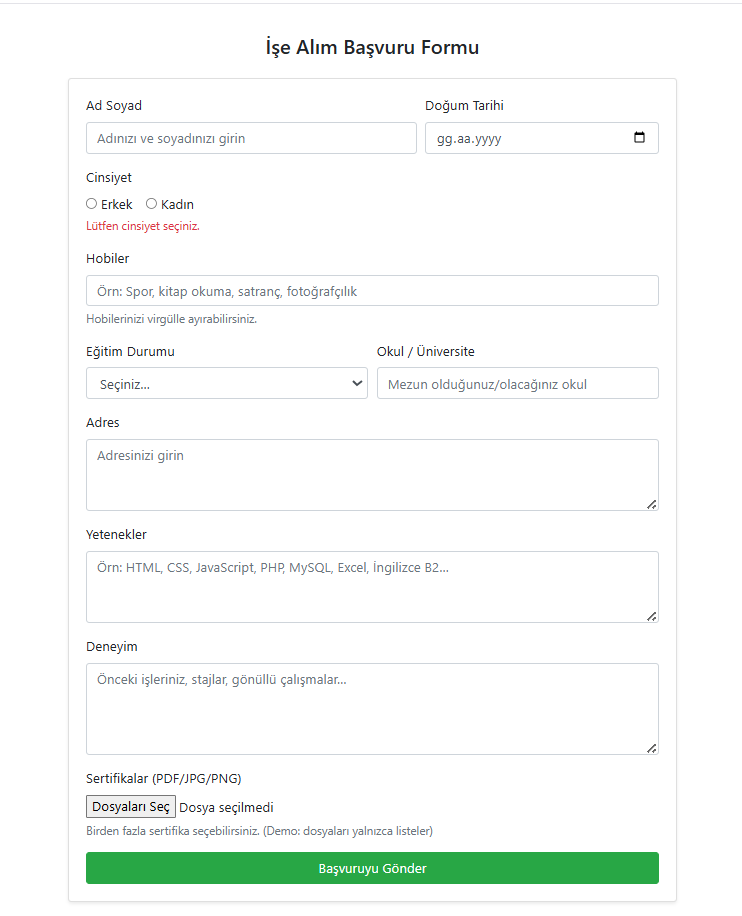
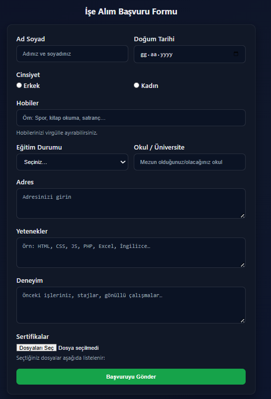

```
# 📌 Kayıt Formu Projesi

Bu proje, **iki farklı yaklaşımla** modern bir **giriş ve başvuru formu uygulaması** geliştirmek için hazırlandı:  
1. **Bootstrap 4.6** kullanılarak hızlı ve hazır bileşenlerle tasarım.  
2. **Saf HTML + CSS** kullanılarak sıfırdan, tamamen özelleştirilmiş tasarım.
```
---

## 🚀 Proje Yapısı
```
kayit-formu/
├── 01-bootstrap4.6/
│ ├── index.html # Giriş sayfası (Bootstrap)
│ ├── basvuru.html # Başvuru formu (Bootstrap)
├── 02-basic-html-css/
│ ├── index.html # Giriş sayfası (Saf CSS)
│ ├── basvuru.html # Başvuru formu (Saf CSS)
│ └── style.css # Tasarım için özel CSS dosyası
├── screenshots/
│ ├── bootstrap-form.png # Bootstrap form ekran görüntüsü
│ ├── basic-form.png # Saf CSS form ekran görüntüsü
└── README.md
```
---
```
## 🎨 Özellikler

### **Bootstrap 4.6 Versiyonu**
- Hazır bileşenler ile hızlı geliştirme
- Responsive (mobil uyumlu) tasarım
- Şık kart yapıları ve basit renk teması

### **Saf HTML + CSS Versiyonu**
- **Tamamen özel tasarım**: Bootstrap kullanılmadan sıfırdan yazıldı
- Modern, koyu renkli tema
- Hafif, hızlı yüklenen sayfalar
- Tam doğrulama ve hata mesajları
```
---
```
## 📸 Ekran Görselleri

<p align="center">
  
  
</p>

<p align="center">
  
  
</p>
### Saf HTML + CSS
**Giriş Sayfası**
```

```
**Başvuru Formu**
```


---
```
## 🧩 Kurulum ve Kullanım

1. Projeyi bilgisayarına klonla:
   ```bash
   git clone https://github.com/<kullanici-adin>/kayit-formu.git
   
2. Klasöre gir:
   cd kayit-formu

3. 01-bootstrap4.6 klasöründeki index.html veya
   02-basic-html-css klasöründeki index.html dosyasını aç.

4. Tarayıcıda çalıştırmak için VS Code Live Server kullanabilirsin.
```
---
```
📌 Notlar
İki farklı yöntem aynı projede yan yana sunuldu.

Proje, öğrenme sürecimde hazırlandı ve Bootstrap ile saf CSS arasındaki farkları göstermek amacıyla yapıldı.

Saf CSS versiyonu tamamen özelleştirilebilir.

✨ Gelecek Planları
 Form verilerini bir PHP backend ile kaydetme

 MySQL veritabanı entegrasyonu

 QR kod ile başvuru doğrulama özelliği ekleme

👩‍💻 Geliştirici
Ceyda Gezer
📌 Bilgisayar Mühendisliği Öğrencisi
🌐 [GitHub Profilim](https://github.com/ceydagezer)

🏷️ Etiketler  
`HTML` `CSS` `Bootstrap` `Form Design` `Responsive Web Design`
```
